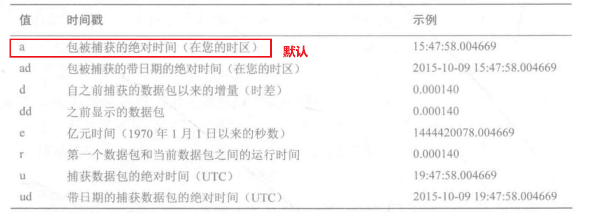
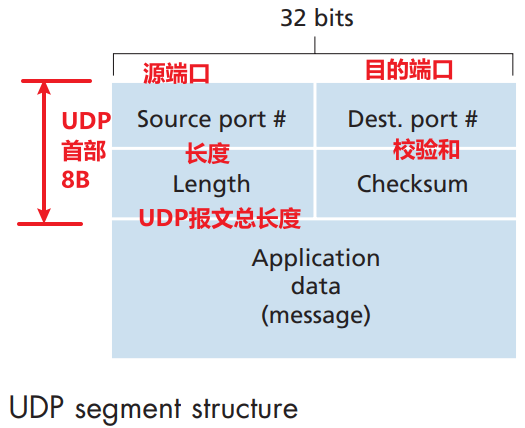
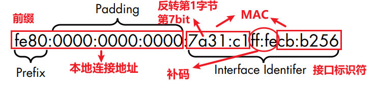

# Wireshark_intro

## 0. 网络通信原理

OSI 七层参考模型在 1983 年制定，标准号 ISO 7498，只是一个行业建议标准，开发时不需要严格遵守，除此之外，还有美国国防部(DoD)的网络模型，即 TCP/IP 模型。

每一层的数据有不同的名称，**物理层-比特，数据链路层-帧，网络层-数据包，传输层-数据段**。

数据封装时将创建一个协议数据单元(PDU)，包括正在发送的网络数据以及增加的头部和尾部协议信息。


### 0.1 网络硬件

> Network Hardware

**集线器(Hubs)**

- 从一个端口接收到数据包，然后将数据包传输(中继)到设备的每个端口上;
- 半双工模式(half-duplex mode)，无法同时接/收数据；
- 将数据广播到每个端口，现代或高密度网络中用交换机(switches)代替；

**交换机(Switches)**

- 转发数据包(repeat packets)，直接将数据发送到目标计算所连接的端口；
- 交换机通过 MAC 地址标识设备，工作在数据链路层(data link layer)；
- 允许同一网段的所有计算机之间进行通信；

**路由器(Routers)**

- 路由器是比集线器和交换机更高级的网络设备，工作在网络层；
- 负责不同网络数据包间的转发，使用 IP 地址唯一标识网络上的设备；

### 0.2 流量分类

> Traffic Classifications

**广播流量(broadcast traffic)**

通过广播发送到网段上的所有端口。主要包括**数据链路层和网络层**两种形式。

- 数据链路层：对应 MAC 地址，FF:FF:FF:FF:FF:FF为广播地址；
- 网络层：对应 IP 地址，一个 IP 范围内，最大的 IP 为广播地址；

**组播流量(Multicast Traffic)**

单一数据包同时传送到多个目标。实现的主要方式是，将数据包接收者加入组播组的编制方案实现。

**单播流量(Unicast Traffic)**

从一个计算机直接传输到另一个计算机。这种端到端的连接方式的具体实现取决于使用的网络协议。

### 0.3 TCP

> connection-oriented，面向连接的 | full-duplex service，全双工服务

TCP 只在端系统中运行，而不在中间的网络元素中运行。中间路由器对 TCP 忽略，看到的只是数据报。**TCP 连接是点对点的，多播情况(一次发送多个数据到接收方)对 TCP 是不可能的。**

**TCP 连接的建立过程**

标志位 SYN=1 | 序列号字段 Sequence Number | 确认字段 ACK

1. **SYN 报文段**
   1. 客户端 TCP 向服务器 TCP 发送一个 SYN=1 的报文字段；
   2.  报文字段：SYN=1, seq=client_isn；
2. **SYNACK 报文段**
   1. 服务器 TCP 提取 SYN 报文段，并发送 SYNACK 报文段；
   2. 服务器为该 TCP 连接分配缓存和变量；
   3. 报文字段：SYN=1, ack=client_isn+1，seq=server_isn；
3. **SYNACK 报文段**
   1. 客户端给 TCP 连接分配缓存和变量；
   2. 连接已经建立，第 3 次握手可以携带客户到服务器的数据；
   3. SYN=0, seq=client_isn+1, ack=server_isn+1；


## 1. 基本特性

- packet list：数据包列表；
- packet details：数据包细节；
- packet bytes：数据包字节；


**标记数据包**

`ctrl+m`：标记/取消数据包的颜色，默认为黑底白字；

`ctrl+shift+n` | `ctrl+shift+b`：在标记数据包中前后切换；

### 捕获(capture)

`ring buffer`：环状缓冲；


### 过滤器

**捕获过滤器：**满足给定表达式的数据包会被捕获

**显示过滤器：**用于已捕获的数据包，显示需要的数据包

#### BPF 语法

使用 Berkeley Packet Filter(BPF) 语法，该语法广泛应用于多种数据嗅探工具，其中 libpcap/WinPcap 库依赖于 BPF 语法。

BPF 语法创建的过滤器称为 expression (表达式)，每个表达式包含一个或多个 primitives (原语)，每个原语包含一个或多个qualifiers(限定词)，其后再跟着一个 ID 或数字。

- 限定词 `type`：指出名字或数字代表的意义，如 host, net, port；
- 限定词 `dir`：指出传输方向的来向和去往的地址，src, dst；
- 限定词 `proto`：限定匹配的协议，Ether, ip, udp, http. ftp；
- 逻辑运算符：`&& | || | !`

```bpf
dst host 192.168.0.10 && tcp port 80
# 过滤器形式
src host 192.168.0.10 && port 80

port 8080
!port 8080
dst port 8080
```

**协议域过滤器**

匹配一个数据包从某一特定位置开始的一定数量的字节。

```BPF
icmp[0] == 3

# 从数据包头部的偏移量0处开始2字节数据
icmp[0:2] == 0x0301
```

#### 捕获过滤器实例

TCP 数据包的标志位在偏移为 13 字节的地方。

```BPF
# 偏移量，第13字节的第4个比特位
# RST标志位
tcp[13]&4 == 4

# PSH标志位
tcp[13]&8 == 8

# ACK标记位
tcp[13]&16 == 16

# URG标记位
tcp[13]&32 == 16

# SYN标记位
tcp[13]&2 == 2

# FIN标记位
tcp[13]&1 == 1

# TCP SYN-ACK数据包
tcp[13] == 18
```

本机 Ethernet MAC：`84-69-93-4D-5A-51`。

```BPF
ether host 84:69:93:4D:5A:51
!ether host 84:69:93:4D:5A:51
# 广播
broadcast
# ipv4
ip
# ipv6
ip6
```

#### 显示过滤器实例

```BPF
# 过滤与某个IP地址相关的数据包
ip.addr == 192.168.0.1

# 只显示两个IP地址的数据包
ip.addr == 192.168.0.1 or ip.addr == 192.168.0.2

# 帧长度小于128B的数据包
frame.len <= 128
```

**常用的显示过滤器**

```BPF
# 具有SYN标记位的TCP数据包
tcp.flags.syn == 1

# 排除RDP流量
!tcp.port == 3389

# 文本管理流量(Telnet或FTP)
tcp.port == 23 || tcp.port == 21

# 文本email流量(SMTP,POP,IMAP)
smtp || pop || imap
```

## 2. 高级特性

host: MAC-D8:80:83:42:41:B7 |  IP-10.10.48.231； | [WHOIS 查询](https://www.whois365.com/cn/)

### 端点

> Endpoint

Statistics 选项**对捕获的数据**进行统计，Statistics > Endpoints 选项：


### 会话

> Conversation

可勾选解析名称：


### 协议分层统计

> Protocol Hierarchy


### 名称解析

> Name Resolution, 编辑 ->> 首选项

- Resolve MAC address：使用 ARP 协议，将 MAC 转换为 IP 地址；
- Resolve Transport name：将一个端口号转换为一个与其相关的名字，如 80 端口对应的 http；
- Resolve Network/IP name：将  IP  地址转换为域名；

**自定义 hosts 文件**

hosts 文件的实质是 IP 地址列表和与之对应的名字组成的文本文件，注意这个文件的名称就是 hosts，不用后缀。

### 协议解析

> protocol dissectors, 协议解析器


[wireshark 源码](https://gitlab.com/wireshark/wireshark)对应的解析器地址：


### 流追踪

wireshark 中可将不同包的数据重组为统一易读的格式。一般称为 packet transcript。支持 4 种类型的流跟踪：

- TCP 流：重组使用 TCP 协议数据，如 HTTP 和 FTP；
- UDP 流：重组使用 UDP 协议数据，如 DNS；
- SSL 流：重组加密协议，如 HTTPS；
- HTTP 流：从 HTTP 协议中重组和解压数据；


**SSL/TSL**

SSL（Secure Sockets Layer）是一种用于保护网络通信安全性的协议，Netscape 于1994年发布  SSL 1.0，1995年 SSL 2.0，其是 SSL 协议的首个公开版本，1996年发布 SSL 3.0。

TLS（Transport Layer Security）解决 SSL 3.0 中的一些安全性问题，目前主要是 TLS 1.2, TLS 1.3 版本。


## 3. Tshark命令行

> Tshark 本地说明文档

### Tshark 设定

对于未按照默认安装路径安装的 wireshark，可手动将安装路径添加到系统变量中，如 `E:\Wireshark4.2.6\Wireshark`。

```shell
# 版本
tshark -v
# 查看可用的网卡接口
tshark -D
# 输出结果，以数字列表形式打印出当前可用网卡的信息
1. \Device\NPF_{A049DC19-C955-492B-90F3-D74AE62FBE8B} (本地连接* 8)
2. \Device\NPF_{FA064409-DE65-4FD3-8774-04A1D56481E1} (本地连接* 7)
3. \Device\NPF_{8FBE2ABA-85F9-4A63-9D8F-70712382C31A} (本地连接* 6)
4. \Device\NPF_{A5A3D727-3A5B-4C2A-8119-2AD78038F2BA} (WLAN)
5. \Device\NPF_{EF03E31D-A37A-4584-8D75-49A6073BF476} (WLAN 4)
6. \Device\NPF_{B67C3033-C22C-4799-A6CA-23436AEFA890} (WLAN 3)
7. \Device\NPF_{BB31B7AC-527A-4AC7-8C77-6B353A63802B} (WLAN 2)
8. \Device\NPF_Loopback (Adapter for loopback traffic capture)
9. \Device\NPF_{E88BFEAC-F018-4DB2-A30C-B1F956CB185D} (以太网)
10. etwdump (Event Tracing for Windows (ETW) reader)

```

切换使用其中的一个网卡：

```shell
# -i 参数 + 网卡编号
tshark -i 4
```

### 基本操作

```shell
# 知道Ctrl+C中断，否则保存到当前路径中demo.pcap文件中
tshark -i 4 -w demo.pcap 
# 读取文件
tshark -r demo.pcap
tshark -r demo.pcap -c3

# 只抓取前10个包保存
tshark -i 4 -w demo.pcap -c10
```

Tshark 中每一行代表一个数据包，其底层使用和 wireshark 一样的解析器分析数据，通过添加 `-V` 实现数据包的详细输出，相当于 wireshark 数据包点开后的内容：

```shell
tshark -r demo.pcap -V -c1
# 以16进制的形式显示数据包的内容
tshark -xr demo.pcap
```

#### 名称解析

```shell
# -n禁用名称解析
tshark -ni 4
# 仅启动传输层和MAC层的解析，其余不启用
tshark -i 4 -Ntm
```

- m：MAC 地址解析；
- n：网络地址解析；
- t：传输层解析；
- N：使用外部解析服务；
- C：使用当前 DNS 解析；

#### 过滤器

> applying filters

使用 `-f` 参数应用于捕获过滤器，BPF 语法在双引号中：

```shell
tshark -ni 1 -w packet.pcap -f "tcp port 80"
```

使用 `-Y` 参数应用于显示过滤器：

```shell
tshark -ni 1 -w packet.pcap -Y "tcp port 80"
```

对包含大量数据包的捕获文件进行二次过滤：
```shell
tshark -r packet_all.pcap "tcp port 80" -w extract_port.pcap
```

通过 `-f` 指定 BPF 文件来进行过滤：

```shell
tshark -r input.pcap -f filter_file.bpf -w output.pcap
```

#### 时间显示格式

使用 `-t` 参数中的 `ad` 显示绝对时间：

```shell
tshark -ni 4 -t ad
```



#### Tshark 总结统计

通过 `-z` 参数实现

```shell
tshark -z help
# 获取 IP 会话(conversations)
tshark -r packets.pcap -z conv,ip

# Follow: tcp,ascii
# Filter: tcp.stream eq 0
# 以ASCII的形式将0号的TCP流打印到屏幕上
tshark -r packets.pcap -z follow,tcp,ascii,0
```

`-z` 参数功能强大，有许多有用的选项。

## 4. 数据包结构

> 计算机网络：自顶向下方法（原书第8版） ([美]詹姆斯·F.库罗斯, [美]基思·W.罗斯, 陈鸣) 

Statistics > 分组长度，较大的数据包表示**数据传输**，较小的数据包表示**协议控制序列**，一般为 1280~2559 字节。

根据协议头一般大小判定，TCP 控制数据包至少是 54B 大小。

太网帧的报头包括以下几个部分：

1. **目的地址（Destination Address, DA）**：6B
2. **源地址（Source Address, SA）**：6B
3. **类型/长度字段（Type/Length）**：2B

所以，以太网报头的总字节数是 6（目的地址）+ 6（源地址）+ 2（类型/长度字段）= **14B**，**有数据的话还包含 4B 的 CRC 校验位**。

### Ethernet 帧

Ethernet 报头为 14B


### IP 数据包

IP 数据包头至少为 20B；


### TCP 数据段

不包含数据及选项的 TCP 数据段也是 20B；


### UDP 数据段



## 5. 网络层协议

> ARP, IPv4, IPv6, ICMP, ICMP6

### ARP

TCP/IP 中将 IP 地址解析为 MAC 地址的过程称为地址解析协议(Address Resolution Protocol, ARP)，ARP 协议在 RFC826 中进行定义，其中MAC 解析过程中只使用两种数据包：

- Request for Comments，RFC 是定义协议实现标准的官方文档；
- ARP 请求数据包，ARP 响应数据包；

ARP 请求和响应：

- 本机的 IP 为×，MAC 为×；需要向 IP 为×发送数据，谁有其 MAC 地址；
- 要找 IP 地址对应的 MAC 为×；
- **解析完成后，将 MAC 和 IP 的对应关系进行缓存；**
- 在 Windows 系统中，可通过 `arp -a` 命令查看 ARP 表；

#### ARP 数据包


- 硬件类型：数据链路层使用的类型数据，一般为 Ethernet，类型1；
- 协议类型：正在使用的高层协议；
- 硬件地址长度：MAC 地址长度，为 6 字节，48 位；
- 协议地址长度：IP 地址长度，4 字节，32 位；
- 操作：1 表示请求，2 表示响应；
- 发送方的硬件地址：MAC 地址 48 位；
- 发送方协议地址：IP 地址 32 位；


#### Gratuitous ARP 

> 无偿的 ARP

多数情况下，一个设备的 IP 地址会变动，从而导致主机缓存中 MAC 和 IP 的映射失效。而 Gratuitous ARP 请求发送后，则强制要求所有收到的设备更新 MAC 和 IP 的映射关系。

设备 IP 地址变动时会生成 Gratuitous ARP，一些操作系统在启动的时候也会进行无常的 ARP 发送。

### IPv4

> RFC791 定义的 IPv4

IP 地址 32 位，包含两个部分：网络地址和主机地址。网络地址标识设备中的局域网，主机则标识设备本身。网络掩码(network mask)则用于标识网络地址和主机地址。

为简便起见，IP 和网络掩码使用**无类型域间路由**(Classless Inter-Domain Routing, CIDR)的形式表示，如：10.10.1.22/16 ，`/` 右边表示网络部分的位数。


- 存活时间(time to live)：定义了数据包被丢弃前经历的时间，或者是能够经过的最大路由数，一般来说每经过一个路由器时 TTL-1；
- IP 数据包是否分片取决于最大传输单元(maximum transmission unit, MTU)，以及数据链路层的设备配置情况；

### IPv6

IPv4 的地址空间有限，1998 年发布了 IPv6 的第一个版本 RFC 2460。IPv6 有 128 位，用 8 组 2 字节的 16 进制表示。

IPv6 分为网络部分和主机部分，称为**网络前缀(network prefix)和接口标识符(interface identifier)**，根据 IPv6 通信的类别不同，两个地址的分布也不同，IPv6 通信类别：unicast，anycast，multicast。

单播本地连接：在同一网络下和另一个设备通信用到的本地连接地址 



- `fe80:0000:0000:0000`(前10位为 1111111010)，一个地址的前半部分为此表示是一个本地连接地址；
- 后半部分 64 位是 MAC(48位)+补码(ff:fe) 得到，代表接口标识符；
- IPv6 用 CIDR 记法表示位 `fe80:0000:0000:0000:/64`


